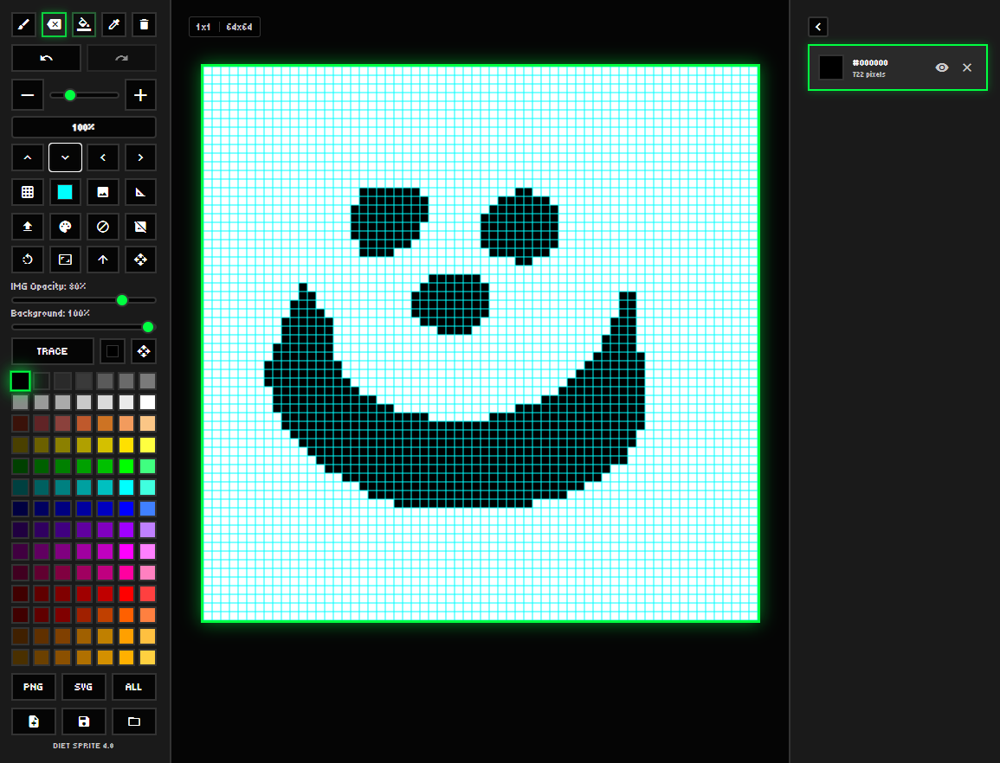

# Diet Sprite

**A lightweight, browser-based pixel art editor** with a retro SNES/PS1-inspired workflow. Built with vanilla HTML, CSS, and JavaScript—no frameworks, no build step. Optimized for desktop and iPad/touch, with color-based layers and a full toolset in a ~500 KB footprint.

[](LICENSE)

---

## Table of Contents

- [Features](#features)
- [Quick Start](#quick-start)
- [Screenshot](#screenshot)
- [Project Structure](#project-structure)
- [Architecture](#architecture)
- [Tech Stack](#tech-stack)
- [Development](#development)
- [License](#license)

---

## Features

- **Drawing tools** — Brush, eraser, fill, eyedropper, clear canvas
- **Dynamic canvas** — 8–1024 px, aspect ratio presets (1:1, 16:9, 9:16, custom)
- **SNES/PS1 palette** — 50-color palette plus custom color support
- **Color-based layers** — Each color acts as a togglable layer (visibility, clear, recolor)
- **Background image** — Import, move/scale/rotate, opacity, and **trace to pixel art** (with progress and cancel)
- **Unlimited undo/redo** — Full history for drawing and layer operations
- **Zoom & pan** — Slider, buttons, and gesture-friendly behavior
- **Save & load** — Project JSON and SVG import; backward compatible with older saves
- **Export** — PNG, SVG, JSON, or “Export All” in one flow
- **Rulers & grid** — Toggle grid, grid color, ruler guides
- **Touch & iPad** — Touch-friendly UI and Apple Pencil–aware input

---

## Quick Start

**Requirements:** Python 3 (for the included server) or Node.js. No build step.

1. **Clone the repo**

   ```bash
   git clone https://github.com/jimmytheghost/diet-sprite.git
   cd diet-sprite
   ```

2. **Start a local server** (pick one):

   **Windows**

   ```bat
   launch.bat
   ```

   **macOS / Linux**

   ```bash
   ./launch.command
   ```

   **Cross-platform (Python)**

   ```bash
   python -m http.server 8550
   ```

   **Or with npm**

   ```bash
   npm install
   npm run serve
   ```

3. **Open in your browser**
   ```
   http://localhost:8550/index.html
   ```

Stop the server with `Ctrl+C` in the terminal.

---

## Screenshot



---

## Project Structure

```
.
├── index.html          # Single-page app shell and modals
├── styles.css          # Layout, theming, responsive styles
├── launch.bat          # Windows: start HTTP server
├── launch.command       # macOS/Linux: start HTTP server
├── README.md
├── LICENSE
├── package.json        # Dev tooling (ESLint, Prettier, serve script)
└── js/
    ├── app.js          # Bootstrap, history, zoom/pan, shortcuts
    ├── app-context.js  # Global state accessors
    ├── grid.js         # Pixel grid, drawing, fill, trace, rendering
    ├── layers.js       # Color-layer visibility and operations
    ├── palette.js      # Palette UI and current color
    ├── tools.js        # Active tool and clear-canvas flow
    ├── background.js   # Background image and transforms
    ├── ruler.js        # Ruler overlay
    ├── canvas-size-modal.js  # Canvas size / aspect ratio modal
    ├── modal-utils.js  # Reusable modal behavior
    ├── input-utils.js  # Touch/click helpers
    ├── save-load.js    # JSON/SVG load and save
    └── export.js       # PNG/SVG/JSON export
```

---

## Architecture

- **State** — Global app state lives on `window`; `AppContext` provides typed accessors. The grid holds the pixel matrix and canvas dimensions.
- **History** — `HistoryManager` in `app.js` records draw and layer actions and supports unlimited undo/redo.
- **Canvas** — Three stacked canvases: background image, pixel grid (+ grid lines), and ruler overlay. Drawing and hit-testing are zoom-aware.
- **Modals** — Built with `modal-utils.js` (open/close, focus trap, Escape, overlay). Used for canvas size, clear confirmations, color picker, save/export, trace progress.

---

## Tech Stack

- **HTML5** + **CSS3** — Layout and styling
- **Vanilla JavaScript (ES6+)** — No framework
- **HTML5 Canvas** — Pixel rendering and export
- **Local HTTP server** — For development (Python or `npm run serve`)

---

## Development

Formatting and linting:

```bash
npm install
npm run lint        # Run ESLint
npm run lint:fix    # Auto-fix lint issues
npm run format      # Prettier (write)
npm run format:check  # Prettier (check only)
```

Contributions are welcome. Open an issue or submit a pull request.

---

## License

This project is licensed under the MIT License — see [LICENSE](LICENSE) for details.
